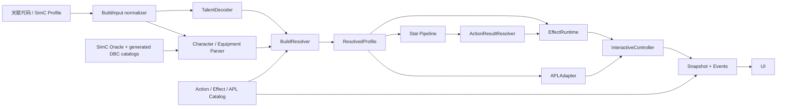

# 12.1 野性德鲁伊训练器架构

## 目标与真实性边界

固定天赋码只是一号验收样本。更换同版本野性德鲁伊构筑时，正常路径只新增输入数据；不得修改 UI 或 `InteractiveController`，已覆盖的通用机制也不得新增技能专用分支。

当前运行时覆盖技能可用性、天赋等级、静态基础/二级属性、宝石与附魔静态修正、装备触发、能量与连击点、逐目标命中/暴击结果、DoT/Buff 时间、概率/PPM/RPPM/累加器触发、可重叠 DoT 实例、万灵之召与隐秘捕食者的内部技能、荒野追猎者血棘藤蔓、四件套联动和交互式 APL 子集，不计算伤害，也不承诺随机序列或完整 APL 与 SimulationCraft 等价。所有已选但未实现或明确排除的效果必须出现在 `unsupportedEffects`，不得静默丢弃。

## 模块流

## 模块边界

| 模块 | 职责 | 禁止承担的职责 |
| --- | --- | --- |
| `core/build-input.js` | 把单独天赋码和 SimC 文本规范化为统一输入 | 推导技能和效果是否可用 |
| `core/talent-decoder.js` | 按 12.1 天赋树解码节点、层级、等级、选择与当前激活英雄子树；保留未激活子树用于无损回写 | 写入战斗数值或 APL |
| `core/equipment-parser.js` | 无运行时目录依赖地解析槽位、物品、等级、奖励、宝石、附魔、制造属性与稳定变体键 | 猜测未知物品属性或执行饰品效果 |
| `core/equipment-resolver.js` | 从版本化 SimC Oracle 与 Equipment Modifier Catalog 解析已登记装备、宝石和附魔静态属性，按数据目录识别物品特效来源 | 静默接受未知变体或把饰品判断写死在 UI |
| `core/item-effect-resolver.js` | 把装备来源匹配到经过变体校验的动作/效果实现，汇总部分支持与明确排除项 | 执行 proc 或猜测未验证物品等级数值 |
| `core/set-bonus-resolver.js` | 从装备物品 ID 自动识别 2/4 件套，并报告显式配置与装备赛季冲突 | 把不同赛季套装视作同一效果 |
| `data/12.1/feral-stat-data.js` | 固化 12.1/90 级基础属性、评分分母、递减曲线和野性精通/AP 系数 | 保存某个 Profile 的最终 buffed 面板 |
| `core/stat-resolver.js` | 汇总角色与装备静态属性，按 SimC 规则计算暴击、急速、精通、全能和 AP，并保留完成度 | 在缺少换算依据时伪造完整面板属性 |
| `core/build-resolver.js` | 计算 requirements、资源修正、替换技能、过滤 APL，输出 `ResolvedProfile` | 执行战斗、渲染 UI |
| `data/12.1/feral-game-data.js` | 版本化 Action/InternalAction/Effect/APL/套装目录与覆盖状态 | 保存某套构筑专用的启用布尔值 |
| `data/12.1/feral-item-effect-data.js` | 保存精确装备变体、物品动作、触发效果、静态宝石/附魔修正及覆盖状态 | 在控制器中按物品名执行特效 |
| `runtime/effect-runtime.js` | 执行通用 hook、触发、ICD、Aura 和资源操作 | 读取 DOM 或选择推荐技能 |
| `runtime/action-result-resolver.js` | 用独立随机流生成逐目标 hit/crit 结果并输出统一事件 | 直接实现具体天赋触发 |
| `runtime/custom-handler-registry.js` | 集中登记不可通用化的特殊机制 | 允许特殊机制散落到控制器/UI |
| `apl/feral-apl-adapter.js` | 在已过滤规则上做交互式推荐 | 推荐 `ResolvedProfile` 中不存在的技能 |
| `core/interactive-controller.js` | 提供稳定训练接口，维护时间轴并输出 Snapshot/Events | 按具体天赋名称改变公开接口 |
| `app.js` | 从 Catalog、Snapshot、Events 动态渲染和转发输入 | 判断天赋机制、触发概率或技能数值 |

## 核心契约

`ResolvedProfile` 是所有构筑输入的统一终点，至少包含：

- 解码后的天赋和套装；
- 角色、装备变体、基础/派生属性、套装识别来源与冲突；
- 已启用/禁用 Action 与 Effect；
- 资源、替换关系、可追踪 DoT/Buff；
- 每项启用效果的 `resolvedModifiers`，包含实际天赋等级、套装条件、解析操作、运行时 modifier 与 hook；
- 已过滤的 APL 规则；
- 结构化 `unsupportedFields` 与 `unsupportedEffects`；
- 明确的真实性边界。

控制器接口固定为 `startSession`、`pressAction`、`advanceTime`、`setActiveTarget`、`getSnapshot`、`getRecommendation`、`drainEvents`、`resetSession`。切换构筑通过 `startSession({ buildInput })` 完成。

## 效果机制

通用运行时公开登记：`on_session_start`、`on_action_impact`、`on_action_result`、`on_action_cast`、`on_builder`、`on_finisher`、`on_combo_overcap`、`on_dot_tick`、`on_dot_state_change`、`on_auto_attack`、`on_aura_tick`、`on_channel_start`、`on_channel_tick`、`on_channel_complete`、`percent_proc`、`ppm`、`rppm`、`accumulator_proc`、`internal_cooldown`、`resource_overflow_buffer`、`aura_stack`、`aura_refresh`、`aura_consume`、`aura_sync`、`random_choice`、`combat_stat_modifier`、`modify_duration`、`replace_action`、`execute_internal_action`、`independent_dot` 与 `target_selector`。

直接技能使用独立的 `ActionResultResolver` 随机流逐目标生成 `ACTION_RESULT`。木桩环境当前命中率固定为 100%，暴击率来自 `ResolvedProfile.combatStats`、动态 Aura 和 Effect modifier。原始狂怒只订阅 `on_action_result + anyCrit`：多目标技能任一目标真实暴击时只增加一次连击点，不再用“至少一次暴击概率”代替实际结果。效果随机流与结果随机流分离，新增命中判定不会改变既有 proc 的固定种子序列。

特殊效果只能通过 `customHandler` 在注册表集中声明。当前注册项只有：

- `feral_convoke`：复现 SimC 12.1 猫形态牌组、目标选择、DoT 替换和特殊施法洗牌；
- `feral_unseen_predator`：复现按有效连击点触发、1/3 目标潜袭、5 目标横扫、追猎层数消费与渴望延长。

荒野追猎者的茁壮生长、双生萌芽、植入与根系网络没有新增 `customHandler`：它们分别由通用累加器、独立 DoT 实例、内部动作、目标选择器、Aura 消费和 Aura 同步组合实现。普通血棘藤蔓可叠加 20 个独立实例；双生萌芽只复制普通藤蔓且不递归；植入在获得或失去猛虎之怒时生成，并由下一次单目标近战能力消费；根系网络按全部目标上的活动藤蔓实例总数同步 0–20 层，最后一条藤蔓结束时移除。

万灵内部技能位于 `InternalAction Catalog`，不会进入玩家动作条或改变控制器公开接口。内部免费终结技同时携带“实际消耗连击点”和“有效结算连击点”，确保丛林之魂、猛虎坚韧、概率触发及套装效果按满连击点结算，但不会扣除玩家资源。

## 更换天赋门禁

自动验收使用“用户验证构筑”和“原始之怒多目标构筑”：

- `Lunar Inspiration` 构筑启用 `moonfire`、禁用 `primalWrath`；另一构筑相反；
- 不可用技能不能被 APL 推荐，也不能成功施放；
- 原始之怒对 3 个目标应用 Rip，另一构筑跟踪 Moonfire DoT；
- 两套构筑使用同一个 UI 和控制器；
- 能量、连击点、DoT、Buff、percent proc、PPM proc 和四件套联动均通过自动测试；
- 1/2 级不竭能量、1/4 级隐秘捕食者会得到不同的最终资源和机制；
- 未激活的英雄天赋子树不得进入 `ResolvedProfile`；
- 所有监控状态必须解析为 12.1 `SpellMisc.SpellIconFileDataID`，且本地图标文件存在；
- 验收产物必须包含完整 `ResolvedProfile diff` 及两侧 `unsupportedEffects`。

荒野追猎者另使用 Implant 与 Twin Sprouts 两套同版本构筑交叉验收：

- `Thriving Growth` 的 Rip/Rake 基值、活动 DoT 数量 0.52 次方衰减、0–2 随机倍率、1000 阈值和余数保留均由通用累加器执行；
- `Green Thumb` 把累加基值乘 1.2；
- 普通藤蔓经 `Resilient Flourishing` 与 `Circle of Life and Death` 后为 6.4 秒/1.6 秒一跳；Implant 藤蔓为 6 秒/1.6 秒一跳；
- Twin Sprouts 在单目标形成两层，在 3/5 目标优先复制到无藤蔓目标；
- 切换 Implant/Twin 不修改 UI 或控制器，`ResolvedProfile diff` 输出 `internalActionChanges`、效果变化和两侧 `unsupportedEffects`；
- DoT 监控由 Catalog 自动出现真实图标、剩余时间、层数和目标覆盖，UI 不识别任何 Wildstalker 天赋名称。

同一选择节点还增加 Root Network 构筑验收：

- 从 SimC Wildstalker 样本把 `Resilient Flourishing` 切换为 `Root Network`，生成的新天赋码已由本地 SimulationCraft 1210-01 接受并完成模拟；
- `ResolvedProfile diff` 只显示该选择节点、`resilientFlourishingVines` 与 `rootNetwork` 的预期变化，不改变控制器公开接口；
- 每条活动血棘藤蔓对应一层根系网络，Implant 藤蔓结束时从 2 层降至 1 层，最后一条藤蔓结束时 Buff 消失；
- Buff 状态由通用 `on_dot_state_change + aura_sync` 驱动，Catalog 使用已核对的 Blizzard `ability_creature_poison_04` 图标；
- 每层 2% 直接/周期伤害仍以 `impact: damage-only` 保留在 `unsupportedEffects`，该构筑没有资源、DoT、Buff、触发或 APL 状态真实性缺口。

机器可读结果见 `validation/architecture/build-switch-acceptance.json`。

## 扩展一套同版本构筑

1. 传入新天赋码或包含 `talents=` 的 SimC Profile。
2. 查看生成的 `ResolvedProfile` 和 `unsupportedEffects`。
3. 如果新构筑只使用已覆盖机制，不修改引擎、控制器或 UI。
4. 如果出现新机制，优先用 Catalog 中的通用 hook/operation 表达；确实无法通用化时才集中增加 `customHandler`。
5. 把新构筑加入门禁测试，检查技能启停、资源、DoT/Buff、触发和 APL 差异。

网页导入器只负责输入适配：它限制文本大小、调用 `BuildInput normalizer` 和同一控制器做预解析，成功后才持久化并通过既有 `startSession({ buildInput })` 切换构筑。构筑名称始终按纯文本写入 DOM；解析失败保留当前构筑和旧 Profile。UI 展示的未支持统计来自 Snapshot 中的 `unsupportedFields` / `unsupportedEffects`，不会自行判断装备、天赋或技能机制。

完整 SimC Profile 已可无损保留字段和行号，并解析角色信息、15 个装备槽、物品等级、奖励 ID、宝石、附魔与制造属性。`validation/oracles/simc-profile-manifest.json` 登记的 Profile 会由本地锁定版 SimC 批量生成、合并为浏览器可用的装备变体目录；新增样本不修改引擎。已登记变体的物品静态属性以及 Equipment Modifier Catalog 中的宝石/附魔修正会进入 `baseStats`，装备中的套装物品会自动推导 2/4 件套。未知装备变体与未识别宝石仍保留结构化门禁；未进入 Effect Catalog 的饰品、附魔和套装战斗效果进入 `unsupportedEffects`，不得因为静态属性已解析而被视作完整支持。

当前 MID1 精确装备样本已经接入：阿尔盖萨谜盒引导与共享冷却、艾恩先知的凝视 RPPM/750ms ICD/独立精华层数、奥术织线 2 RPPM、伦德雷敏锐 3 RPPM、神灵崇拜者指环 2 RPPM 与水豚/埃基尔松等权随机光环，以及双鹰眼的 `1.02² = 1.0404` 暴击伤害倍率。Loa 分流由通用 `random_choice` 操作执行，不存在戒指名称分支。上述效果只对 Catalog 中登记的精确装备变体启用；其他物品等级不会复用数值。

当前 MID1 完整 Profile 与固定 Demo 的 MID2 套装属于不同赛季：DBC 目录明确区分 MID1 法术 `1264812/1264813` 与 MID2 法术 `1296605/1296606`。若调用方把 MID2 显式配置叠加到 MID1 装备，`ResolvedProfile.setBonuses.conflicts` 和 `unsupportedEffects` 必须同时报告冲突。完整 Profile 未显式覆盖时只按实际装备识别 MID1，不会自动启用 MID2。

属性层已接入 12.1、90 级 SimC 评分分母与 21024 二级属性递减曲线。MID1 夜精灵 Profile 会把职业/种族基础敏捷和耐力、装备静态属性组合后计算 AP、暴击、急速、精通与全能；急速统一影响后续 GCD、标记为急速缩放的引导、DoT 跳频、自动攻击和能量恢复。动态 Aura 的暴击、急速及能量恢复字段仍通过 Catalog 读取，不包含技能名分支。

`baseStats.complete` 和 `derivedStats.complete` 仍为 `false`，因为当前只登记了首个 Profile 所需的夜精灵基础值，且团队增益、消耗品、临时武器油与完整伤害公式尚未进入 Catalog。当前 Profile 中不影响静止输出循环的移速、耐力、闪避和吸血附魔明确列为 `out-of-scope`；艾恩洞察刷新绕过精华 ICD 的已知异常仍列为边缘未支持。无装备的天赋码 Demo 保留有明确来源的验证快照作为降级路径；任何完整 SimC Profile 都不能把最终 buffed snapshot 冒充为可组合的基础属性。

`resolvedProfileDiff()` 除玩家技能、内部技能与效果启用变化外，还输出 `resourceChanges`、`combatStatChanges` 和 `modifierChanges`。因此同一个天赋仍然启用、但等级变化导致能量上限、恢复速度、暴击或触发参数变化时，验收门禁也能直接发现。
